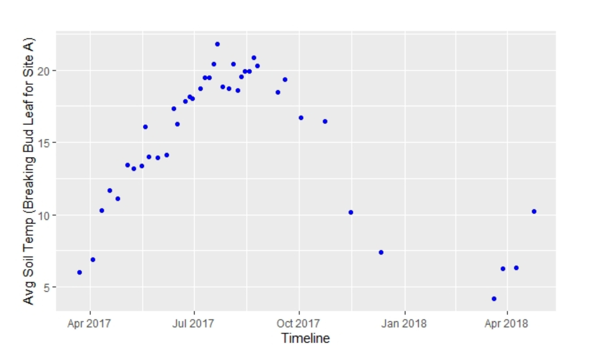
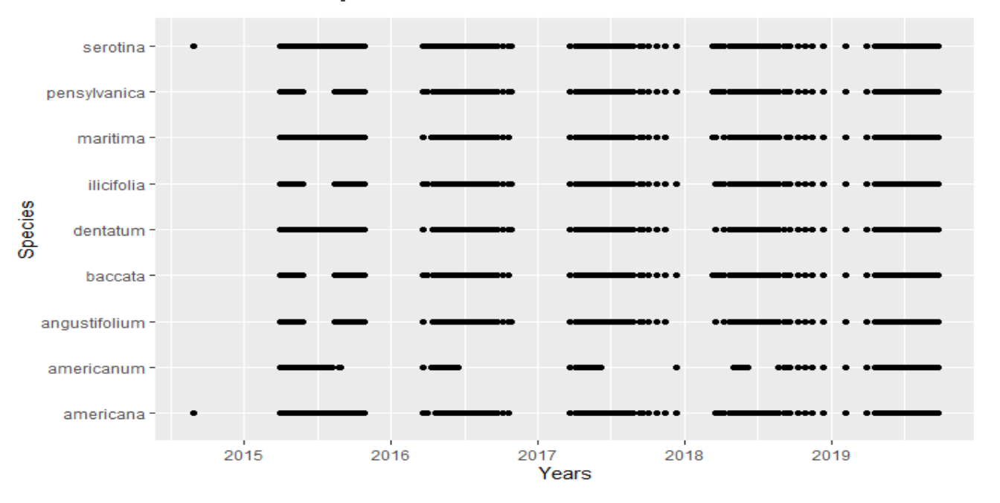
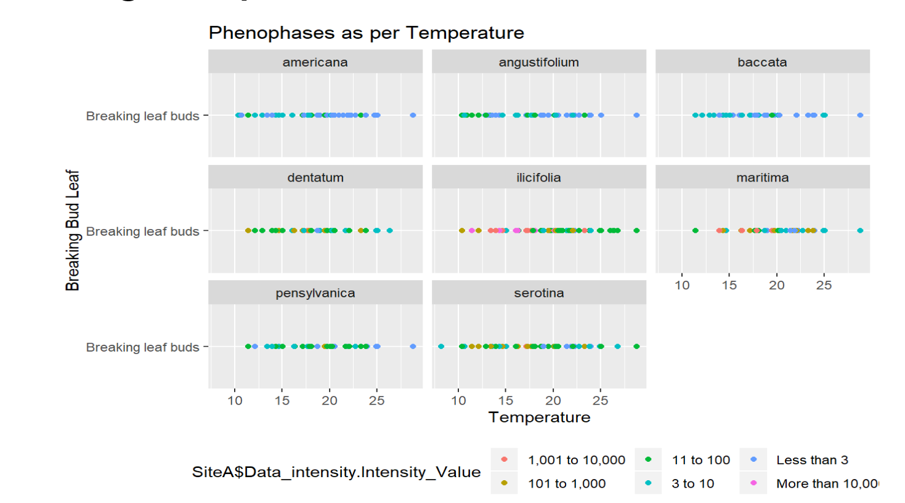
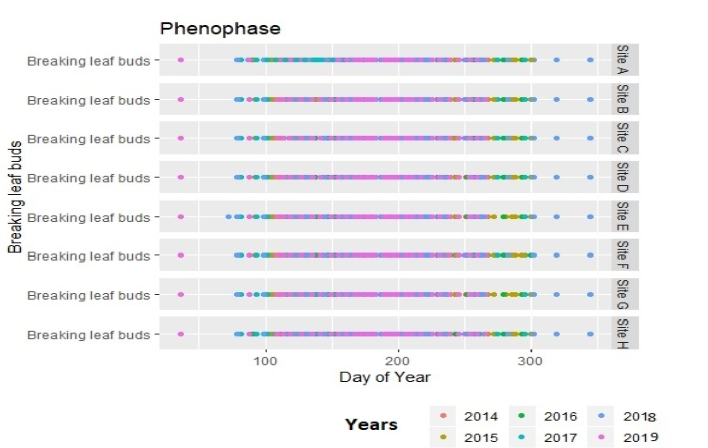

# Target Audiences and Decisions
"Linda Loring  Nature Foundation” being working towards such a good cause attracts many with their intensions of preserving the natural beauty. We have been working to contribute for the best towards this and finally we have some meaningful insights to present. We believe that officials working towards making the foundation flourish everyday will find our study very much helpful. With so much of visible changes in the environment, there is no one timesheet which is being followed by the nature and its components. And plants being of if the nature’s component, which holds number of phenophases in its life cycle needs to be studied on continuous basis to make sure that changes can be pointed out to work upon for continuous better results. Therefore, decision makers of the foundation, who care to introspect our findings to plan out their planning. Ultimate aim was to figure out the pattern which supports the theory as of what conditions are generally preferred by plants of different species at for different phenophase type. Ultimately, we hope to base our theory to support human force who believe in protecting the fragile habitat we have around in the foundation and letting them know, what it takes to achieve so. People who praise the beauty of the foundation, needs to be aware the efforts the beauty demands. We are very specific with the plants and species we considered and therefore it needs to be make sure that our study may not support other studies which is being conducted on other species.Based on our study, concerned members of the foundation can take required measures to make sure that future maintenance of the plants will yield best results. Apart from us, there are many people who are working like us studying effects at different level, in the labs provided by the Foundation, which we hope will be amazed by our findings and use it to make further progress. Staff of the Foundation pursuing PhDs in the field of Data Analytics who have had already contributed towards. As our professor being our advisor and collaborated with Susan T. Bois to have us study on this, and spread our work and findings. Having this as everybody’s ultimate aim, people who cared to contribute in the past for the betterment of the cause may support the study as this will add more sense as what needs  to be done next, having to keep the greenery intact there. On the top of it, for general study of plants as of how each of the driving factors and how changes in attributes of these factors effects the development of plant species can benefit people in general who works towards the flourishment of plants and nature.

# Source Data Processing and Description
Data being recorded since long by concerned people was provided to us to study upon. Linda Lorin Nature Foundation made it easy for us to focus on the datasets at the first place which helped us to focus on studying the data rather to work on preparing or locating proper data which needs to be analyzed. On the top of it, we looked around for more sensible data to match both of the data sets so that all the factors we need to care about can be read at one place. The source data included many attributes but we were more focused on the effect of temperature on the soil and therefore we cared about the dates, timings in connection with the temperature at each point. We had to link this data to distinct phenophase types and therefore we want to thank “nature’s notebook” program to provide us with the data to reach up to the point where we have sensible data at the best. Which helped us to use both of our data sets together without having us going to the trouble of analyzing those differently. We were given with the data associated with 8 different sites recorded which exist at different elevation starting from the year of 2015 which holds for 13 different months in total. Therefore we can say that we have had enough data to support our research. On the top of it, we included soil temperature recorded multiple times everyday for the year of 2017. At last, we included main 4 factors i.e., date, time, Temperature against each and every other phenophase type. Talking specifically, we yielded results which focused more on the specific phenophase type i.e., Breaking of Bud. 
We made it sure while analyzing the data that we have minimum number of bad data cells which could hinder the accuracy of our research. We had many options to work towards the data cleaning but and we thought of eliminating the need to fill blank data with our assumptions and hence removed the rows related to those. 

# Overview Summary
Based on the analysis on our previous sessions, we've had the following interpretation:
## Plot 1: Soil Temperature change Over Years:

As the soil temperature data that we've obtained have pretty limited statistics, we've chosen to study for only the year 2017 to have a basic idea about the changes on temperature of that year. As we can tell from the plot, there are specific outliers on the soil temperature dataset, and the highest temperature takes place in July of the year. There is no specifically surprising phenomenon on the changes of soil temperature. This graph represents the ow Soil Temperature affects the Breaking leave buds phenophase. As we can conclude from this graph that Breaking bud happened around Apr to July and  Average Temperature is above 5 degree celsius. 

## Plot 2: Presence of Species In a Year:

This graph represents the Phenophase "Breaking bud leaf" for each species across the years on the Site A. We can plot for another sites with the same script. From above graph we can conclude that Breaking bud leaf happened after April and stops around october. As it stays almost the same for all the species that we've plotted here, we would assume that it is possible for us to keep an appropriate to attain the healthy growth of all species.

## Plot 3: Relationship between Temperature and Phenophase:

This graph represents the intensity of Breaking Bud leaf for every species on Each site and on what temperature Breaking Bud Phenophase occurred. From this graph we conclude that breaking bud leaf event occurs when temperature range is from 10 to 25 degree celsius.

## Plot 4: Presence of Breaking Leave Buds Periods;

This graph represents the presence of Breaking leaf bud phenophase over the years on the each site. From this graph we can conclude that Breaking Leaf Bud phenophase started around 90th day of the year that is March Ending and occured till 300th day that is around october ending

# Recommendations
Based on the analysis that we have from the above, we would like to make the following recommendations:
* In order to maintain diversity, it is important to predict the temperature changes in the future as it appears that all species react similarly to the change of temperature.
* Specific to breaking leave buds, it seems that this phenophase happens almost 2/3 of the whole year. Although all species have reactions to the change of temperature, it is important to keep in mind that there might be different dominant phenophases happening to different species. 
* Soil temperature reaches the peak in July every year and this might be specifically important to the presence of certain phenophases. Therefore, when it comes to July every year, we need to keep track of the highest temperature and set up alarm for extremely high temperature.
